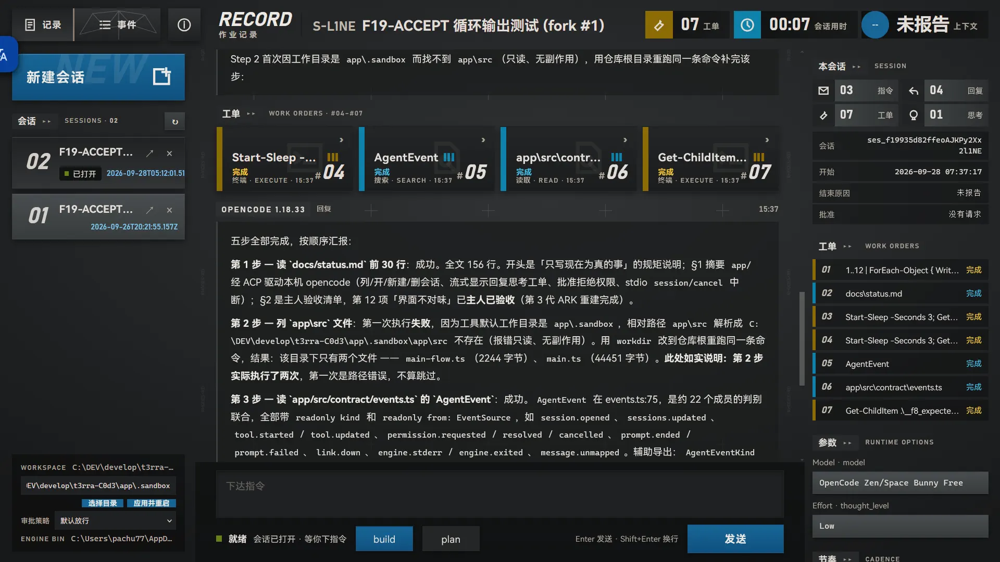
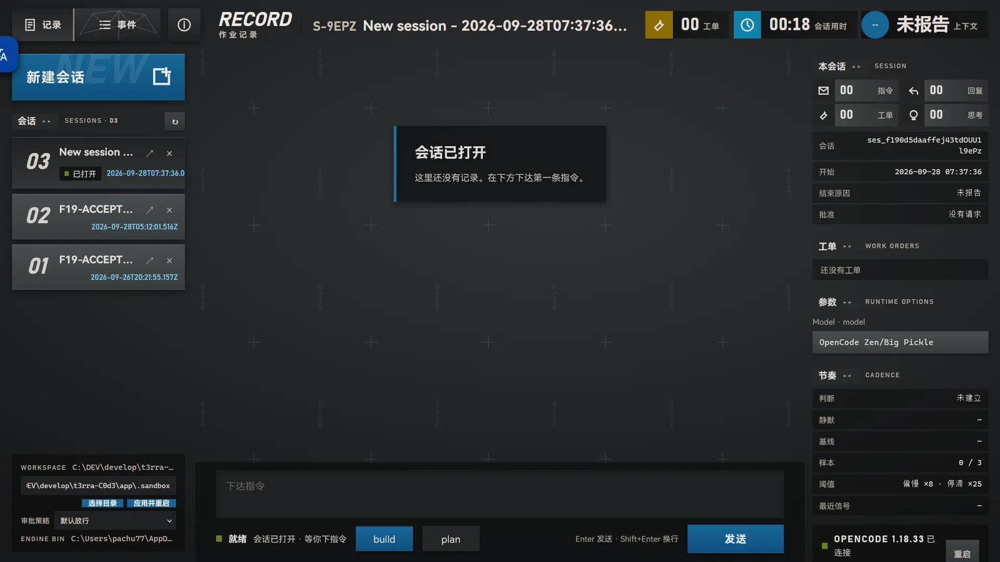
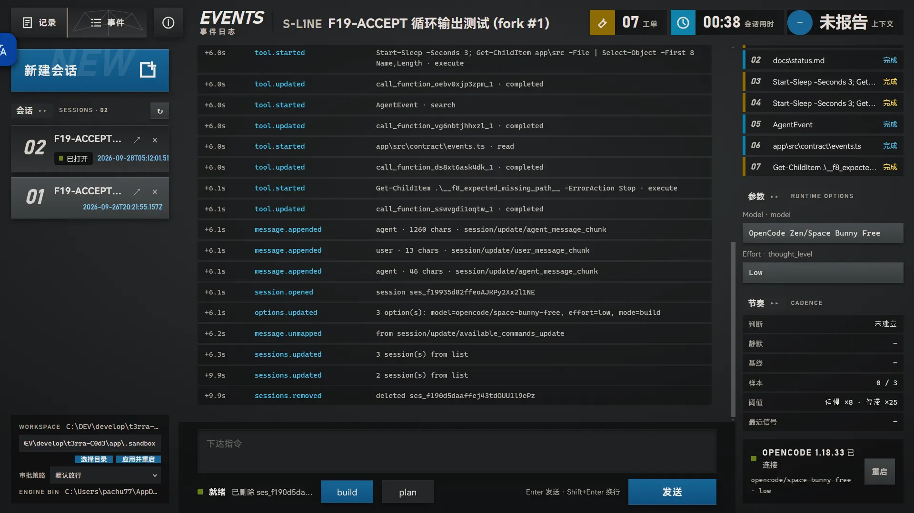

# T3rra-C0d3-Rhodes

T3rra-C0d3-Rhodes 是一个 Windows 优先的桌面 coding-agent 控制台：用 **Tauri 2 + WebView2** 提供轻量外壳，用 **opencode ACP** 负责会话、模型、工具调用和审批，用 ARK 族界面把运行过程清晰地呈现出来。

它适合希望在本机目录中使用 coding agent、同时需要可见状态、审批边界和可恢复会话的人。Rhodes 不替代引擎，也不伪装引擎结果；回复、思考、工单、审批、错误和恢复状态都来自真实运行链路。



## 核心能力

- 连接本机 opencode（ACP，stdio），流式显示回复、思考和工具工单。
- 新建、打开、删除、刷新恢复和分叉会话。
- 原生选择项目目录，切换项目级编辑审批策略。
- 点击工单查看引擎目标、参数、状态、输出和错误。
- 支持批准、拒绝和中止；错误会显示为错误，不会伪装成空结果。
- 支持模式、模型和 effort 切换；引擎提供 usage 时显示上下文用量。





## 技术路线

```text
Tauri 2 / WebView2
        ↓
ARK 族 UI + TypeScript 状态机
        ↓
统一 Transport（浏览器开发桥 / Rust 桌面宿主）
        ↓
opencode ACP（stdio）
```

界面设计说明见 [`docs/design.md`](docs/design.md)，当前状态、验收入口和已知限制见 [`docs/status.md`](docs/status.md)。引擎契约证据集中在 [`docs/adapters/opencode-acp.md`](docs/adapters/opencode-acp.md) 与 [`docs/engine-contract-audit.md`](docs/engine-contract-audit.md)。

## 运行

### 前置条件

- Windows x64、WebView2。
- Node.js 与 npm。
- opencode 1.18.x，并且已经能在终端中正常对话。
- 如果使用 Rust 桌面宿主，还需要 Rust MSVC 工具链。

opencode 的 provider 或免费模型登录由 opencode 自己负责；本项目不把 `authenticate` 成功误判为已经可以出回复。

### 浏览器开发版

```powershell
npm install
npm run check:all
npm run dev
```

打开终端打印的地址，默认是 `http://localhost:5191/`。需要指定引擎时，在启动前设置：

```powershell
$env:T3RRA_ENGINE_BIN = '你的 opencode 可执行文件绝对路径'
npm run dev
```

### Tauri 开发窗口

```powershell
npm run tauri:dev
```

这会启动 Tauri 开发窗口。当前仓库已经具备 Rust 桌面宿主与开发桥双路径；完整桌面回归、脱离仓库安装验证和正式 NSIS 包仍按 [`docs/status.md`](docs/status.md) 的收口计划执行。

## 人工验收

启动后按顺序检查：

1. 选择一个包含中文或空格的项目目录并确定，确认路径自动导入且页面回到就绪。
2. 将审批策略改为「每次询问」，发送一个需要写文件的指令，确认审批卡出现；拒绝不落盘，批准后再核对文件真实存在。
3. 发送一个只读指令，确认回复、工单和 usage（若引擎提供）都按真实状态显示；点击工单可打开和关闭详情。
4. 打开历史会话，等待输入框从「正在回放历史」恢复为「下达指令」后发送新指令；运行中刷新，确认指令只出现一次。
5. 删除测试会话，确认只有列表刷新并验证目标消失后，会话才从列表移除。

机读检查：

```powershell
npm run check:all
npm run build
cargo fmt --manifest-path src-tauri/Cargo.toml -- --check
cargo check --manifest-path src-tauri/Cargo.toml
```

机器检查不能替代界面目视验收。涉及视觉或可见行为的改动，请按上面的步骤逐项核对。

## 当前边界与未来更新

当前产品聚焦单会话 coding-agent 主流程。多会话、文件树、diff、终端、搜索、会话导出和图片输入已经列入未来更新计划，不作为本版的隐含承诺。审批写回、跨目录删除分页、生命周期压力、脱离仓库安装和正式安装包等边界与验证状态，以 [`docs/status.md`](docs/status.md) 为准。

## 相关资料

- [`AGENTS.md`](AGENTS.md)：仓库规矩、冷启动规则和目录地图。
- [`docs/design.md`](docs/design.md)：ARK 族视觉标准。
- [`docs/status.md`](docs/status.md)：当前状态、验收步骤和发布前清单。
- [`demo/ark.html`](demo/ark.html)：仓库内视觉金标准样张。

## License

本仓库当前用于个人与内部产品验证。引擎 opencode 的许可与分发边界请以其上游仓库为准。
